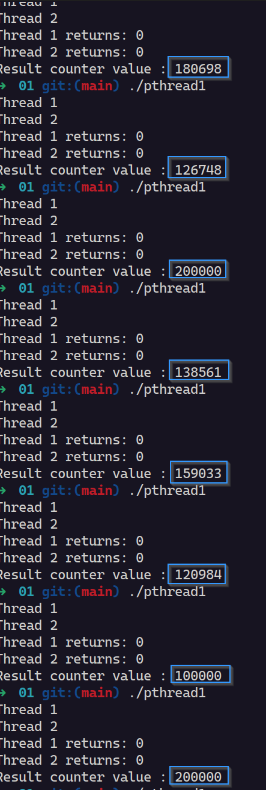
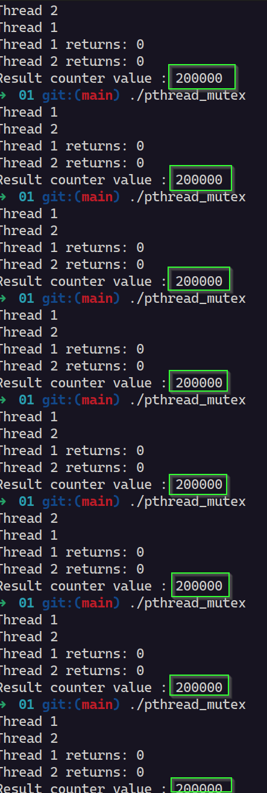

### 2 Threads zählen jeweils eine counter-Variable um 100.000 hoch.

### **Erwartetes Ergebnis: 200.000**

## Ohne Mutex:

## Mit Mutex:

## Beobachtung

Nur bei der Variante mit mutex wird zuverlässig das erwartete Ergebnis von 200.000 erreicht. Bei der Variante ohne Mutex kann es zu nicht deterministischen Ergebnissen kommen. Die Zählvariable kann einen Wert beinhalten, der geringer als 200.000 ausfällt, da der gleichzeitige Zugriff auf die Variable nicht geschützt wird.
